# 🚒 Feuerwehr Management App

Progressive Web App (PWA) für das interne Koordinationsmanagement von Feuerwehren. Keine Datenbank erforderlich - läuft mit Apache + PHP und verschlüsselten JSON-Dateien.

[](https://opensource.org/licenses/MIT)
[](https://php.net)
[](https://web.dev/progressive-web-apps/)

---

## 📑 Inhaltsverzeichnis

- [Features](#-features)
- [Installation](#-installation)
  - [Voraussetzungen](#voraussetzungen)
  - [Installation mit Web-Installer](#installation-mit-web-installer-empfohlen)
  - [Manuelle Installation](#manuelle-installation-alternativ)
  - [PWA-Installation](#pwa-installation-mobile)
- [Offline-Funktionalität](#-offline-funktionalität)
- [Erste Schritte](#-erste-schritte)
  - [Login](#login)
  - [Hauptmenü](#hauptmenü)
- [Administration](#-administration)
  - [Benutzerverwaltung](#benutzerverwaltung)
  - [Standorte-Verwaltung](#standorte-verwaltung)
  - [Einsatzkräfte-Verwaltung](#einsatzkräfte-verwaltung)
  - [Fahrzeug-Verwaltung](#fahrzeug-verwaltung)
  - [Telefonnummern-Verwaltung](#telefonnummern-verwaltung)
  - [Allgemeine Einstellungen](#allgemeine-einstellungen)
  - [E-Mail-Einstellungen](#e-mail-einstellungen)
- [Operator-Bereich](#-operator-bereich)
  - [Formulare](#formulare)
  - [Einsatztools](#einsatztools)
  - [Statistiken](#statistiken)
  - [Formulardaten](#formulardaten)
- [Konfiguration](#️-konfiguration)
- [Sicherheit](#-sicherheit)
- [Technologie-Stack](#-technologie-stack)
- [Support](#-support)
- [Lizenz](#-lizenz)

---

## ✨ Features

### 🔐 Authentifizierung & Sicherheit
- **Drei Benutzerrollen**: 
  - **Global-Admin**: Vollzugriff auf alle Standorte und Systemeinstellungen
  - **Standort-Admin**: Verwaltung eines spezifischen Standorts
  - **Operator**: Formulare & Ansichten (keine Verwaltung)
- **Multi-Standort-Unterstützung**: Mehrere Einsatzabteilungen/Standorte verwalten
- **Verschlüsselte Datenspeicherung**: Alle Daten AES-256-CBC verschlüsselt
- **Sichere Passwörter**: bcrypt-Hashing
- **Session-Management**: Automatischer Timeout
- **XSS & Command Injection Schutz**: Output-Escaping und Whitelisting

### 👥 Personal-Management
- **Einsatzkräfte-Verwaltung**: Zentrale Datenbank aller Mitglieder
- **Qualifikationen**: AGT, Maschinist, Sanitäter
- **Führungsrollen**: Truppführer, Gruppenführer, Zugführer, Verbandsführer
- **Ausbilder-Kennzeichnung**: Separate Markierung für Übungsleiter

### 🚒 Fahrzeug-Management
- **Zentrale Fahrzeugverwaltung**: Ort, Typ, Funkrufname
- **Multi-Select Integration**: Automatische Verfügbarkeit in allen Formularen

### 📋 Dynamische Formulare
- **Anwesenheitsliste** (Übungsdienste):
  - Übungsleiter-Auswahl (nur Ausbilder)
  - Teilnehmer (Multi-Select)
  - Automatische Zeitberechnung
  - Teilnehmerzählung
  - Datei-Upload mit E-Mail-Anhang
  
- **Einsatzbericht**:
  - Vollständige Einsatzdaten (Grund, Ort, Leiter, Lage, Tätigkeiten)
  - Dynamische Fahrzeugbesatzung (1-20 Einsatzkräfte)
  - Beteiligte Personen (dynamisch 0-10)
  - Verdienstausfall-Tracking
  - Kostenpflichtigkeit

- **E-Mail & PDF**: Automatischer Versand als HTML-E-Mail mit PDF-Anhang

### 🛠️ Einsatz-Tools
- **Online Karte**: OpenStreetMap mit Routenberechnung
- **Gefahrenmatrix**: AAAA-CCCC-EEEE Einsatzstellen-Gefahren
- **Gefahrstoffkennzeichen**: UN-Nummern Datenbank mit GHS/ADR-Klassen
- **Wichtige Telefonnummern**: Notfallkontakte mit Direktwahl (tel:-Links)

### 📊 Statistiken
- **Jahres-Übersicht**: Abteilungsweit
- **Personen-Statistiken**: Einzelauswertung je Einsatzkraft
- **Auswertungen**: Übungsstunden, Einsatzstunden, Anzahl Dienste

### 🎨 Design & UX
- **Progressive Web App**: Installierbar auf mobilen Geräten
- **Responsive Design**: Optimiert für Mobile (iPhone 13 Pro) und Desktop
- **Light/Dark Mode**: Automatische Themenwahl passend zu alarm-messenger
- **Touch-optimiert**: Große Buttons für mobile Bedienung
- **Material Design Icons**: Moderne, intuitive Benutzeroberfläche
- **Offline-Funktionalität**: Service Worker für Offline-Nutzung

---

## 🚀 Installation

### Voraussetzungen

- **PHP 7.4+** mit Extensions: `openssl`, `mbstring`, `json`
- **Apache** oder anderer PHP-kompatibler Webserver
- **Git** (für Installation via Repository)

**Hinweis:** Alle PHP-Abhängigkeiten (mPDF, PHPMailer) sind bereits im Repository enthalten - Composer ist nicht erforderlich!

### Installation mit Web-Installer (Empfohlen)

Der Web-Installer ist die einfachste Methode und erfordert **keinen Zugriff auf die Kommandozeile**.

#### 1. Repository klonen oder hochladen
```bash
git clone https://github.com/TimUx/feuerwehr-app.git
cd feuerwehr-app
```

Alternativ: Laden Sie die Dateien per FTP auf Ihren Webserver hoch.

#### 2. Installations-Wizard öffnen
Navigieren Sie zu Ihrer Domain im Browser:
```
http://ihre-domain.de/install.php
```

#### 3. Installations-Schritte durchlaufen
Der Wizard führt Sie durch folgende Schritte:

##### Schritt 1: System-Voraussetzungen prüfen


Der Installer prüft automatisch:
- ✅ **PHP Version** (7.4.0 oder höher erforderlich)
- ✅ **PHP Extensions**: 
  - Erforderlich: `openssl`, `mbstring`, `json`, `session`
  - Empfohlen: `curl`, `gd`, `zip`
- ✅ **Verzeichnis-Berechtigungen** (`config/`, `data/`)
- ✅ **PHP-Konfiguration** (`upload_max_filesize`, `post_max_size`, `memory_limit`)

Sie können erst fortfahren, wenn alle **erforderlichen** Voraussetzungen erfüllt sind. Warnungen bei empfohlenen Features erlauben das Fortfahren.

##### Schritt 2: Willkommen


Übersicht über die Einrichtung und was konfiguriert wird.

##### Schritt 3: Administrator-Benutzer erstellen


Erstellen Sie den ersten Admin-Benutzer:
- **Benutzername** (min. 3 Zeichen)
- **Passwort** (min. 6 Zeichen, mit Bestätigung)

Das Passwort wird automatisch mit bcrypt gehashed und verschlüsselt gespeichert.

##### Schritt 4: E-Mail-Einstellungen


Konfigurieren Sie E-Mail-Einstellungen für Formular-Übermittlungen:
- **Absender E-Mail-Adresse und Name**
- **Standard-Empfänger** (optional)
- **SMTP Server-Einstellungen**:
  - Host, Port, Verschlüsselung (TLS/SSL)
  - Optional: SMTP-Authentifizierung mit Benutzername/Passwort

##### Schritt 5: Installation abgeschlossen


✅ Verschlüsselungsschlüssel automatisch generiert (64 Zeichen, AES-256-CBC)  
✅ Administrator-Benutzer erstellt  
✅ E-Mail-Einstellungen konfiguriert  
✅ Datenverzeichnis erstellt mit sicheren Berechtigungen

**Wichtig:** Der Verschlüsselungsschlüssel wird automatisch generiert - keine Kommandozeile erforderlich!

#### 4. Installation abgeschlossen
Nach erfolgreicher Installation können Sie die App nutzen.

#### 4. Logo hochladen (optional)
Platzieren Sie Ihr Feuerwehr-Logo als `public/assets/logo.png`. Dieses wird in E-Mails und PDFs verwendet.

#### 5. Anmeldung
Nach erfolgreicher Installation und Diagnose können Sie sich mit Ihrem erstellten Administrator-Benutzer anmelden.

---

### Manuelle Installation (Alternativ)

Wenn Sie Zugriff auf die Kommandozeile haben, können Sie die App auch manuell einrichten:

#### 1. Repository klonen
```bash
git clone https://github.com/TimUx/feuerwehr-app.git
cd feuerwehr-app
```

#### 2. Konfigurationsdatei erstellen
```bash
cp config/config.example.php config/config.php
```

#### 3. Verschlüsselungsschlüssel generieren
```bash
php -r "echo bin2hex(random_bytes(16));"
```
Kopieren Sie den generierten Schlüssel und fügen Sie ihn in `config/config.php` als `encryption_key` ein.

#### 4. E-Mail-Konfiguration anpassen
Öffnen Sie `config/config.php` und passen Sie die E-Mail-Einstellungen an:
```php
'email' => [
    'from_address' => 'noreply@ihre-feuerwehr.de',
    'from_name' => 'Feuerwehr Willingshausen',
    'smtp_host' => 'localhost',
    'smtp_port' => 25,
]
```

#### 5. Berechtigungen setzen
```bash
chmod 700 data
chmod 600 config/config.php
```

#### 6. Anwendung öffnen
Navigieren Sie zu Ihrer Domain im Browser und melden Sie sich an.

**Standard-Zugangsdaten:**
- Benutzername: `admin`
- Passwort: `admin123`

⚠️ **WICHTIG**: Ändern Sie das Passwort sofort nach dem ersten Login!

### PWA-Installation (Mobile)
1. Öffnen Sie die App im Browser auf Ihrem Smartphone
2. Tippen Sie auf "Zum Startbildschirm hinzufügen" (iOS) oder "Installieren" (Android)
3. Die App erscheint als eigenständige Anwendung auf Ihrem Gerät

---

## 📱 Offline-Funktionalität

Die App unterstützt vollständige Offline-Funktionalität für kritische Features - perfekt für den Einsatz in Gebieten mit schlechter Netzabdeckung.

### ✨ Features

**Erweiterte Caching-Strategie**
- Cache-First für statische Assets (CSS, JS, Icons, Fonts)
- Network-First mit Cache-Fallback für API-Endpunkte
- Dynamisches Caching für Seiteninhalte
- Intelligentes Cache-Versioning und automatisches Cleanup

**Offline-Formular-Speicherung**
- Formulare können offline ausgefüllt werden
- Daten werden lokal in IndexedDB gespeichert
- Automatische Synchronisation bei Verbindungswiederherstellung
- Background Sync API für automatische Formular-Übermittlung im Hintergrund

**Benutzeroberfläche**
- Online/Offline-Statusanzeige (unten rechts)
- Sync-Button mit Badge für ausstehende Formulare
- Benachrichtigungssystem für Sync-Feedback
- Offline-Banner auf Formularseiten

### 📋 Verwendung

#### Offline-Formulare ausfüllen

1. **Navigieren Sie zu einem Formular** (Anwesenheitsliste oder Einsatzbericht)
2. **Wenn offline:** Ein gelber Banner wird oben im Formular angezeigt
3. **Füllen Sie das Formular aus** wie gewohnt
4. **Klicken Sie auf "Absenden"**
5. **Das Formular wird lokal gespeichert** und zeigt eine Bestätigung

#### Synchronisation

**Automatisch:**
- Wenn die Verbindung wiederhergestellt wird, synchronisiert die App automatisch alle ausstehenden Formulare
- Eine Benachrichtigung bestätigt erfolgreiche Synchronisationen

**Manuell:**
- Klicken Sie auf das Sync-Symbol (🔄) in der Kopfzeile
- Das Badge zeigt die Anzahl der ausstehenden Formulare
- Nach dem Klicken werden alle ausstehenden Formulare sofort übermittelt

#### Offline-Status

- **Grünes Symbol:** Online und synchronisiert
- **Rotes Symbol:** Offline-Modus aktiv
- Der Status wird automatisch aktualisiert

### 🎨 Neue UI-Komponenten

#### 1. Online/Offline-Statusanzeige (unten rechts)

**Wenn OFFLINE:**
- Erscheint unten rechts mit rotem Rahmen
- Rotes Cloud-Off-Icon
- Text: "Offline"

**Wenn ONLINE:**
- Grüner Rahmen
- Grünes Cloud-Done-Icon
- Text: "Online"
- Verschwindet automatisch nach kurzer Zeit

#### 2. Sync-Button in der Kopfzeile

**Normal (keine ausstehenden Formulare):**
- Button ist versteckt

**Mit ausstehenden Formularen:**
- Erscheint rechts neben Theme-Toggle
- Badge zeigt Anzahl der ausstehenden Formulare
- Badge pulsiert zur Aufmerksamkeit
- Klick startet manuelle Synchronisation
- Button rotiert während Synchronisation

#### 3. Offline-Banner in Formularen

**In Anwesenheitsliste und Einsatzbericht (wenn offline):**
- Gelber Hintergrund mit Warnsymbol
- Informiert Benutzer über Offline-Modus
- Text: "Offline-Modus - Formulare können offline ausgefüllt werden und werden automatisch gesendet, sobald Sie wieder online sind."
- Verschwindet wenn online

#### 4. Benachrichtigungssystem

**Bei Offline-Speicherung:**
- Gelbe Warnung: "Keine Internetverbindung. [Formular] wurde offline gespeichert und wird automatisch gesendet, sobald Sie wieder online sind."

**Bei erfolgreicher Synchronisation:**
- Grüne Bestätigung: "X Formular(e) erfolgreich synchronisiert"

**Bei Sync-Fehler:**
- Rote Fehlermeldung: "Synchronisierung fehlgeschlagen"

### 📱 Benutzer-Workflows

#### Szenario 1: Offline Formular ausfüllen

1. **Benutzer öffnet Anwesenheitsliste**
   - Offline-Banner erscheint (gelb)
   - Status-Indikator zeigt "Offline" (rot, unten rechts)

2. **Benutzer füllt Formular aus**
   - Alle Felder funktionieren normal
   - Datepicker, Dropdowns, etc. funktionieren

3. **Benutzer klickt "Absenden"**
   - Warnung erscheint: "Keine Internetverbindung. Anwesenheitsliste wurde offline gespeichert..."
   - Formular wird zurückgesetzt
   - Sync-Button erscheint mit Badge "1"

4. **Benutzer kann weitermachen**
   - Weitere Formulare ausfüllen möglich
   - Badge erhöht sich: "2", "3", etc.

#### Szenario 2: Automatische Synchronisation

1. **Internet kehrt zurück**
   - Status-Indikator wechselt zu "Online" (grün)
   - Automatische Sync startet (im Hintergrund)

2. **Während Sync**
   - Sync-Button rotiert
   - Badge bleibt sichtbar

3. **Nach erfolgreicher Sync**
   - Benachrichtigung: "2 Formular(e) erfolgreich synchronisiert"
   - Badge verschwindet
   - Sync-Button verschwindet
   - Formulare wurden an Server gesendet
   - E-Mails wurden versendet

#### Szenario 3: Manuelle Synchronisation

1. **Benutzer ist online**
   - Hat ausstehende Formulare (Badge "2")

2. **Benutzer klickt Sync-Button**
   - Button dreht sich
   - Formulare werden übermittelt

3. **Nach Sync**
   - Benachrichtigung zeigt Ergebnis
   - Badge wird aktualisiert oder verschwindet

### 🛠️ Technische Details

**Unterstützte Formulare:**
- ✅ Anwesenheitsliste
- ✅ Einsatzbericht

#### Technische Implementierung

**1. Enhanced Service Worker (`sw.js`)**
```
Cache-Strategien:
├── Cache-First: Statische Assets (CSS, JS, Icons)
├── Network-First: API-Endpunkte, Seiteninhalte
└── Network-Only: Formular-Submissions (mit Offline-Fallback)

Features:
├── Intelligentes Caching mit Versioning (v2)
├── Automatische Cache-Cleanup
├── Background Sync Support
└── IndexedDB-Integration für Form-Sync
```

**2. Offline Storage (`public/js/offline-storage.js`)**
```
Funktionen:
├── IndexedDB-Initialisierung
├── Formulare speichern
├── Ausstehende Formulare abrufen
├── Synchronisation mit Server
├── Background Sync Registrierung
└── Fehlerbehandlung
```

**3. Offline UI (`public/js/offline-ui.js`)**
```
UI-Komponenten:
├── Online/Offline-Statusanzeige (unten rechts)
├── Sync-Button mit Badge (Kopfzeile)
├── Benachrichtigungssystem
└── Offline-Banner auf Formularen
```

**4. Integration in Haupt-App (`public/js/app.js`)**
```
Erweiterungen:
├── Offline-Support-Initialisierung
├── Formular-Handler mit Offline-Erkennung
├── Konfiguration für unterstützte Formulare
└── Graceful Degradation
```

**5. Shared Utilities (`public/js/offline-utils.js`)**
```
Hilfsfunktionen:
├── Offline-Banner-Management
├── DOM-Ready-Checks
└── Wiederverwendbare Utilities
```

**Cache-Strategien:**

*Cache-First (Statische Assets)*
```
Request → Cache → Network (fallback)
```
Verwendet für CSS, JavaScript, Bilder, Icons und Fonts

*Network-First (API & Pages)*
```
Request → Network → Cache (fallback)
```
Verwendet für API-Endpunkte, Seiteninhalte und dynamische Daten

*Network-Only (Formulare & Verwaltung)*
```
Request → Network (no cache)
```
Verwendet für Formular-Submissions (außer bei Offline), Admin-Funktionen und Benutzer-Verwaltung

**Browser-Unterstützung:**

| Feature | Chrome/Edge | Firefox | Safari | Mobile |
|---------|------------|---------|--------|--------|
| Service Worker | ✅ 45+ | ✅ 44+ | ✅ 11.1+ | ✅ |
| IndexedDB | ✅ 24+ | ✅ 10+ | ✅ 10+ | ✅ |
| Background Sync | ✅ 49+ | ⚠️* | ⚠️* | ⚠️** |
| Cache API | ✅ 40+ | ✅ 41+ | ✅ 11.1+ | ✅ |

*Fallback auf manuelle Synchronisation verfügbar  
**Teilweise unterstützt auf Android Chrome

⚠️ Hinweis: Manuelle Synchronisation steht als Fallback in allen Browsern zur Verfügung

**Datenspeicherung:**

Alle offline gespeicherten Formulare werden in IndexedDB gespeichert:
- **Datenbank:** `FeuerwehrAppDB`
- **Object Store:** `pending-forms`
- **Gespeicherte Felder:** ID, Formulartyp, Ziel-URL, FormData, Zeitstempel, Status

**Dateigröße:**
```
Neue Dateien:
├── sw.js (erweitert): +5 KB
├── offline-storage.js: 8 KB
├── offline-ui.js: 9 KB
├── offline-utils.js: 1 KB
└── style.css (Ergänzung): +3 KB

Gesamt: ~26 KB zusätzlich (unkomprimiert)
```

**Performance:**
- **Keine Auswirkungen** im Online-Modus
- **Schnellere Ladezeiten** durch Caching
- **Offline-Formulare** speichern in <100ms
- **Synchronisation** hängt von Netzwerkgeschwindigkeit ab

### 🔒 Sicherheit

- ✅ Alle Daten werden nur lokal im Browser gespeichert
- ✅ Keine sensiblen Daten werden im Cache gespeichert
- ✅ Formulardaten werden nach erfolgreicher Synchronisation gelöscht
- ✅ HTTPS erforderlich für Service Worker in Produktion
- ✅ CodeQL Scan: 0 Alerts - keine Sicherheitsrisiken

### 🧪 Testing und Debugging

#### Offline-Test durchführen:

1. Chrome DevTools öffnen (F12)
2. Network Tab → Online → **Offline** wählen
3. Formular ausfüllen und absenden
4. In IndexedDB (Application Tab) prüfen
5. Online → **Online** wechseln
6. Automatische Sync beobachten

#### IndexedDB anzeigen (Chrome):

```
F12 → Application Tab → IndexedDB
└─► FeuerwehrAppDB
    └─► pending-forms
        └─► Gespeicherte Formulare anzeigen
```

**Struktur eines gespeicherten Formulars:**
```json
{
  "id": 1,
  "type": "Anwesenheitsliste",
  "url": "/src/php/forms/submit_attendance.php",
  "data": FormData {},
  "timestamp": "2025-01-15T10:30:00.000Z",
  "status": "pending"
}
```

#### Cache Storage anzeigen (Chrome):

```
F12 → Application Tab → Cache Storage
└─► feuerwehr-app-static-v2
    ├─► /, /index.php, /public/css/style.css
    ├─► /public/js/app.js
    └─► /public/icons/...
└─► feuerwehr-app-dynamic-v2
    └─► Seiteninhalte
└─► feuerwehr-app-api-v2
    └─► API-Responses
```

#### Service Worker anzeigen (Chrome):

```
F12 → Application Tab → Service Workers
└─► sw.js
    └─► Status: activated and is running
    └─► Update on reload ☐
```

#### Konsolen-Logs:

**Beim Laden der App:**
```
[SW] Installing service worker...
[SW] Caching static assets
[SW] Activating service worker...
[App] Offline support initialized
[OfflineStorage] Database opened successfully
[OfflineUI] Offline UI initialized
```

**Bei Offline-Formular:**
```
Form submission error: TypeError: Failed to fetch
[OfflineStorage] Form saved offline: Anwesenheitsliste 1
[OfflineUI] Pending count: 1
[OfflineStorage] Background sync registered
```

**Bei Sync:**
```
[SW] Background sync triggered
[SW] Found 2 pending forms to sync
[OfflineStorage] Submitting form: 1 Anwesenheitsliste
[SW] Successfully synced form: 1
[OfflineUI] Form synced by service worker: 1
[OfflineStorage] Form submitted successfully: 1
```

### ⚠️ Bekannte Einschränkungen

1. **Datei-Uploads:** Datei-Uploads in der Anwesenheitsliste funktionieren offline, werden aber mit dem Formular gespeichert
2. **Browser-Storage-Limits:** IndexedDB hat Browser-abhängige Speichergrenzen (typisch 50-100MB)
3. **Background Sync:** Nicht in allen Browsern verfügbar (siehe Browser-Unterstützung)

### 🐛 Fehlerbehebung

**Problem: Formulare werden nicht synchronisiert**

Lösung:
1. Überprüfen Sie die Internetverbindung
2. Klicken Sie auf das Sync-Symbol in der Kopfzeile
3. Öffnen Sie die Browser-Konsole (F12) für Details

**Problem: Offline-Status wird nicht angezeigt**

Lösung:
1. Stellen Sie sicher, dass JavaScript aktiviert ist
2. Löschen Sie den Browser-Cache und laden Sie die Seite neu
3. Überprüfen Sie, dass der Service Worker registriert ist (F12 → Application → Service Workers)

**Problem: Cache wird nicht aktualisiert**

Lösung:
1. Die App verwendet Cache-Versionierung - alte Caches werden automatisch gelöscht
2. Bei Problemen: Browser-Cache manuell löschen
3. Service Worker-Update erzwingen: F12 → Application → Service Workers → "Update"

### 📊 Zusammenfassung der Implementierung

Die Offline-Funktionalität wurde vollständig umgesetzt:

✅ **Offline-Cache vorhanden** - Wichtige Informationen und Funktionen offline verfügbar  
✅ **Formulare offline ausfüllbar** - Anwesenheitsliste und Einsatzbericht  
✅ **Lokale Speicherung** - IndexedDB speichert Formulardaten sicher  
✅ **Automatische Synchronisation** - Daten werden automatisch gesendet, wenn online  
✅ **E-Mail-Versand** - Nach erfolgreicher Sync werden E-Mails wie gewohnt versendet  
✅ **Benutzerfreundlich** - Klare visuelle Indikatoren und Benachrichtigungen  
✅ **Sicher** - Keine Sicherheitsrisiken, alle Daten lokal  
✅ **Browser-kompatibel** - Funktioniert in allen modernen Browsern  
✅ **Erweiterbar** - Einfach weitere Formulare hinzufügbar

Die PWA ist jetzt vollständig offline-fähig! 🎉

---

## 🚀 Erste Schritte

### Login

Nach der Installation können Sie sich mit Ihrem Administrator-Benutzer anmelden. Die App bietet einen modernen Login-Bildschirm im Light- und Dark-Mode:

<table>
<tr>
<td width="50%">
<b>Light Mode</b><br/>
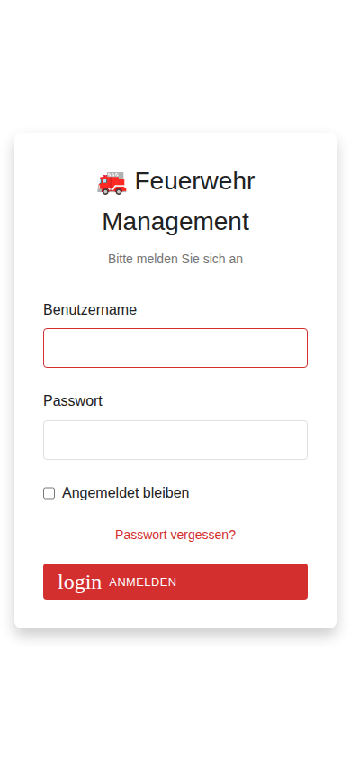
</td>
<td width="50%">
<b>Dark Mode</b><br/>
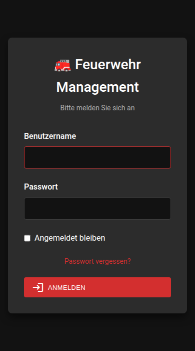
</td>
</tr>
</table>

Die App unterstützt **drei Benutzerrollen**:
- **Global-Admin**: Vollzugriff auf alle Standorte und Systemeinstellungen
- **Standort-Admin**: Verwaltung eines spezifischen Standorts
- **Operator**: Zugriff auf Formulare und Ansichten (keine Verwaltung)

### Hauptmenü

Nach erfolgreicher Anmeldung gelangen Sie zum Hauptmenü, das schnellen Zugriff auf alle wichtigen Funktionen bietet:

<table>
<tr>
<td width="50%">
<b>Light Mode</b><br/>
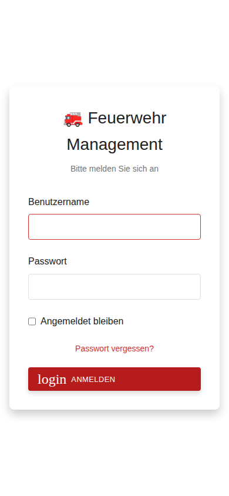
</td>
<td width="50%">
<b>Dark Mode</b><br/>
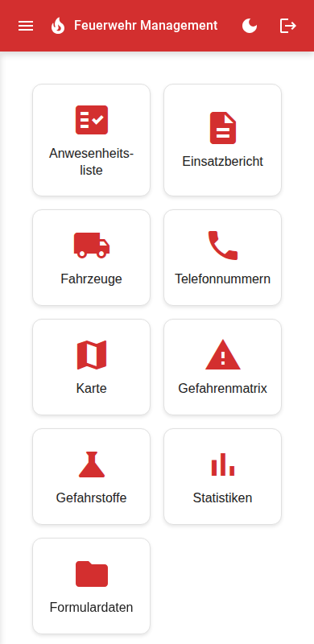
</td>
</tr>
</table>

Das Hauptmenü ist in zwei Bereiche unterteilt:

**Operator-Funktionen** (für alle Benutzer verfügbar):
- 📋 Anwesenheitsliste
- 🚒 Einsatzbericht
- 🚗 Fahrzeuge (Ansicht)
- 📞 Wichtige Telefonnummern
- 🗺️ Online Karte
- ⚠️ Gefahrenmatrix
- ☣️ Gefahrstoffkennzeichen
- 📊 Statistiken
- 📁 Formulardaten

**Administration** (nur für Admins sichtbar):
- 📍 Standorte verwalten
- 🔧 Fahrzeuge verwalten
- 👥 Einsatzkräfte verwalten
- 📞 Telefonnummern verwalten
- 👤 Benutzerverwaltung
- ⚙️ Allgemeine Einstellungen (nur Global-Admin)
- ✉️ E-Mail-Einstellungen (nur Global-Admin)

---

## 🔧 Administration

Der Administrationsbereich steht nur Benutzern mit Admin-Rechten (Global-Admin oder Standort-Admin) zur Verfügung.

### Benutzerverwaltung

Die Benutzerverwaltung ermöglicht das Erstellen und Verwalten von App-Benutzern mit verschiedenen Rollen und Zugriff.

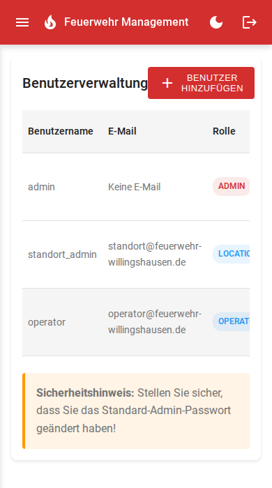

#### Benutzerrollen

##### 1. **Global-Admin** (Globaler Administrator)
- 🌍 **Vollzugriff** auf das gesamte System
- ✅ Kann alle Einsatzabteilungen/Standorte verwalten
- ✅ Kann alle Benutzer (Global und Standort) erstellen, bearbeiten und löschen
- ✅ Zugriff auf alle Fahrzeuge, Einsatzkräfte und Daten aller Standorte
- ✅ Kann globale Einstellungen (E-Mail, Allgemein) konfigurieren
- ✅ Kann neue Standorte anlegen und verwalten
- 🔑 **Erkennung**: Kein Standort zugewiesen (wird als "Global" angezeigt)

##### 2. **Standort-Admin** (Lokations-Administrator)
- 📍 **Eingeschränkter Zugriff** auf einen bestimmten Standort
- ✅ Kann nur Benutzer des eigenen Standorts verwalten
- ✅ Kann nur Fahrzeuge des eigenen Standorts verwalten
- ✅ Kann nur Einsatzkräfte des eigenen Standorts verwalten
- ✅ Kann Formulare für den eigenen Standort ausfüllen
- ✅ Kann Statistiken des eigenen Standorts einsehen
- ❌ **Kein Zugriff** auf:
  - Globale Einstellungen (E-Mail, Allgemein)
  - Andere Standorte und deren Daten
  - Anlegen neuer Standorte
- 🔑 **Erkennung**: Hat einen Standort zugewiesen (z.B. "Willingshausen")

##### 3. **Operator** (Sachbearbeiter)
- 📋 **Lesezugriff** und Formularnutzung
- ✅ Kann Formulare ausfüllen (Anwesenheitsliste, Einsatzbericht)
- ✅ Kann Einsatztools nutzen (Karte, Gefahrenmatrix, Gefahrstoffkennzeichen)
- ✅ Kann Statistiken einsehen
- ✅ Kann Telefonnummern einsehen
- ❌ **Keine Verwaltungsrechte**:
  - Keine Bearbeitung von Einsatzkräften
  - Keine Bearbeitung von Fahrzeugen
  - Keine Benutzerverwaltung
  - Keine Systemeinstellungen

#### Anwendungsfälle

**Szenario 1: Einzelne Feuerwehr**
- Ein Global-Admin für die Verwaltung
- Mehrere Operators für Formular-Eingabe

**Szenario 2: Mehrere Standorte (z.B. Gemeinde mit mehreren Ortswehren)**
- Ein Global-Admin für übergreifende Verwaltung
- Je ein Standort-Admin pro Ortswehr (Willingshausen, Leimbach, etc.)
- Operators an jedem Standort für tägliche Arbeit
- Jeder Standort-Admin verwaltet nur seine eigene Ortswehr

#### Funktionen der Benutzerverwaltung
- ➕ Benutzer erstellen
- ✏️ Benutzer bearbeiten
- 🔒 Passwort ändern
- 🗑️ Benutzer löschen
- 📍 Standort zuweisen (für Standort-Admins und Operators)
- 👁️ Übersicht aller Benutzer (Global-Admin) oder Standort-Benutzer (Standort-Admin)

### Standorte-Verwaltung

Zentrale Verwaltung aller Einsatzabteilungen und Standorte der Feuerwehr.

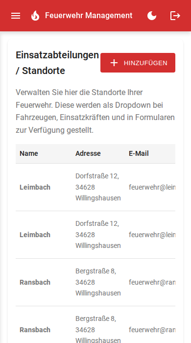

**Verwaltete Informationen:**
- Name des Standorts
- Adresse
- E-Mail-Adresse (für standortspezifische E-Mails)

**Funktionen**:
- ➕ Standort hinzufügen (nur Global-Admin)
- ✏️ Standort bearbeiten
- 🗑️ Standort löschen (nur Global-Admin)
- 🔍 Übersichtliche Tabellen-Darstellung

**Verwendung:**
Standorte werden bei der Verwaltung von Fahrzeugen, Einsatzkräften und in Formularen als Dropdown zur Verfügung gestellt. Standort-Admins sehen nur ihren zugewiesenen Standort, Global-Admins können alle Standorte verwalten.

### Einsatzkräfte-Verwaltung

Zentrale Verwaltung aller Feuerwehrmitglieder mit umfassenden Informationen zu Qualifikationen und Führungsrollen.

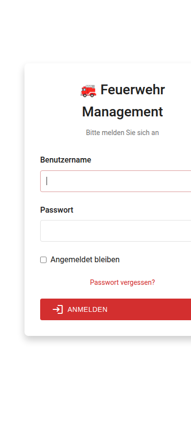

**Verwaltete Informationen:**
- **Persönliche Daten**: Name
- **Qualifikationen**: 
  - AGT (Atemschutzgeräteträger)
  - Maschinist
  - Sanitäter
- **Führungsrollen**:
  - Truppführer
  - Gruppenführer
  - Zugführer
  - Verbandsführer
- **Ausbilder**: Kennzeichnung für Übungsleiter

**Funktionen**:
- ➕ Einsatzkraft hinzufügen
- ✏️ Einsatzkraft bearbeiten
- 🗑️ Einsatzkraft löschen
- 🔍 Übersichtliche Tabellen-Darstellung

Die Einsatzkräfte werden automatisch in allen Formularen (Anwesenheitsliste, Einsatzbericht) zur Auswahl bereitgestellt.

### Fahrzeug-Verwaltung

Verwaltung aller Feuerwehrfahrzeuge mit detaillierten Informationen für den Einsatz.

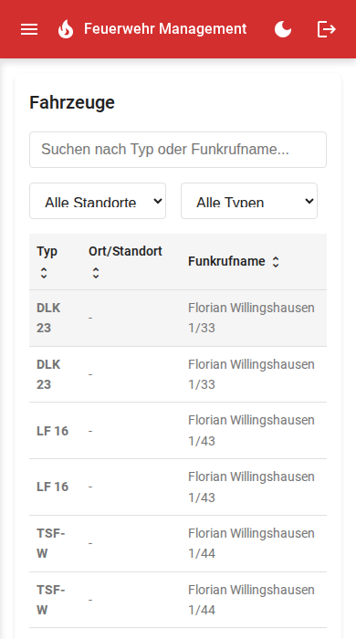

**Verwaltete Informationen:**
- **Standort** (Ort)
- **Fahrzeugtyp** (z.B. TSF-W, LF 16)
- **Funkrufname** (z.B. Florian Willingshausen 1/44)

**Funktionen**:
- ➕ Fahrzeug hinzufügen
- ✏️ Fahrzeug bearbeiten
- 🗑️ Fahrzeug löschen

Fahrzeuge werden automatisch in allen Formularen (Einsatzbericht) zur Auswahl bereitgestellt.

### Telefonnummern-Verwaltung

Verwaltung wichtiger Notfallkontakte und Telefonnummern für schnellen Zugriff im Einsatzfall.

**Verwaltete Informationen:**
- Name
- Firma/Organisation
- Funktion
- Telefonnummer

**Funktionen**:
- ➕ Telefonnummer hinzufügen
- ✏️ Telefonnummer bearbeiten
- 🗑️ Telefonnummer löschen

Die Telefonnummern sind für alle Benutzer (auch Operators) im Hauptmenü sichtbar und können direkt per tel:-Link angerufen werden.

### Allgemeine Einstellungen

Konfiguration der Feuerwehr-Informationen und des Logos (nur Global-Admin).

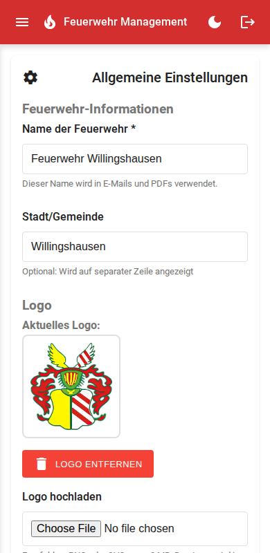

**Verwaltete Einstellungen:**
- **Name der Feuerwehr**: Wird in E-Mails und PDFs verwendet
- **Stadt/Gemeinde**: Optional, wird auf separater Zeile angezeigt
- **Logo**: Upload und Verwaltung des Feuerwehr-Logos für E-Mails und PDFs

**Funktionen**:
- ✏️ Feuerwehr-Informationen bearbeiten
- 📤 Logo hochladen (PNG, max. 2MB)
- 🗑️ Logo entfernen
- 💾 Einstellungen speichern

**Hinweis:** Diese Einstellungen sind nur für Global-Admins zugänglich und wirken sich auf alle Standorte aus.

### E-Mail-Einstellungen

SMTP-Konfiguration für den automatischen Versand von Formular-E-Mails (nur Global-Admin).

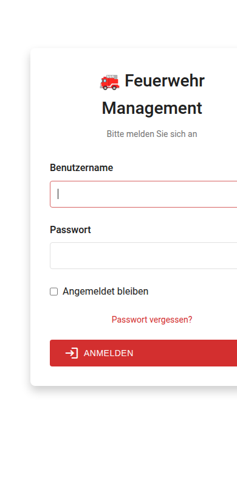

**Konfigurierbare Parameter:**
- **SMTP Server**: Hostname oder IP-Adresse
- **Port**: SMTP-Port (z.B. 25, 465, 587)
- **Verschlüsselung**: Keine, TLS oder SSL
- **Authentifizierung**: Optional mit Benutzername und Passwort
- **Absender**: E-Mail-Adresse und Name
- **Standard-Empfänger**: E-Mail-Adressen für Formular-Versand

**Funktionen**:
- ✏️ SMTP-Einstellungen bearbeiten
- 🧪 Testmail senden zur Überprüfung
- 💾 Konfiguration speichern

**Hinweis:** Diese Einstellungen sind nur für Global-Admins zugänglich und gelten für alle Standorte.

---

## 👤 Operator-Bereich

Der Operator-Bereich steht allen angemeldeten Benutzern zur Verfügung und bietet Zugriff auf Formulare, Einsatztools und Statistiken.

### Formulare

#### Anwesenheitsliste (Übungsdienste)

Vollständiges Formular zur Dokumentation von Übungsdiensten mit automatischer Berechnung und E-Mail-Versand.

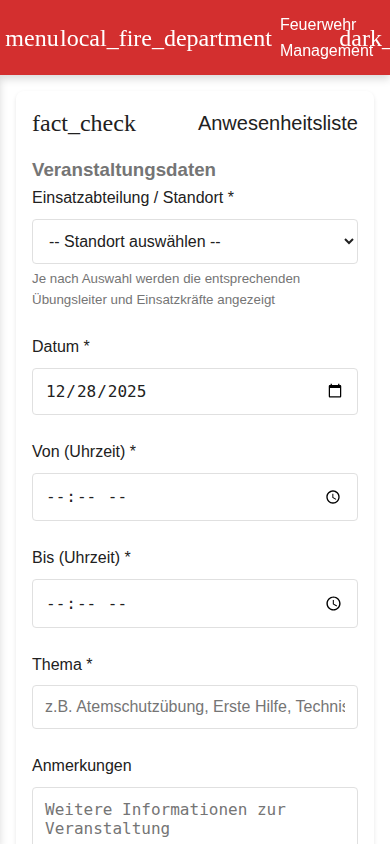

**Felder**:
- 📅 Datum & Uhrzeit (Von/Bis mit automatischer Dauerberechnung)
- 📝 Thema der Übung
- 👨‍🏫 Übungsleiter (nur Einsatzkräfte mit "Ausbilder"-Kennzeichnung oder Freitext)
- 👥 Teilnehmer (Multi-Select aus Einsatzkräften)
- 🔢 Automatische Teilnehmerzählung
- 💬 Anmerkungen (optional)
- 📎 Datei-Upload (optional, wird per E-Mail mitgeschickt)

**Ausgabe**:
- ✉️ HTML-E-Mail mit formatiertem Bericht
- 📄 PDF-Anhang
- 💾 Lokale verschlüsselte Speicherung

#### Einsatzbericht

Umfangreiches Formular basierend auf JetForm-Spezifikation zur vollständigen Dokumentation von Einsätzen.


**Basis-Informationen**:
- 🚨 Einsatzgrund (max. 150 Zeichen) *
- 📅 Einsatzdatum *
- ⏰ Beginn & Ende (mit automatischer Dauerberechnung) *
- 📍 Einsatzort *
- 👨‍🚒 Einsatzleiter *

**Einsatz-Details**:
- 📋 Einsatzlage (Beschreibung) *
- ⚙️ Tätigkeiten der Feuerwehr *
- 🧯 Verbrauchte Mittel (optional)
- ⚠️ Besondere Vorkommnisse (optional)
- 💰 Einsatz kostenpflichtig? (Ja/Nein)

**Fahrzeuge & Besatzung**:
- 🚒 Eingesetzte Fahrzeuge * (Multi-Select aus Fahrzeug-Verwaltung + Sonstiges)
- 👥 **Dynamische Fahrzeugbesatzung** (1-20 Einsatzkräfte):
  - Funktion (Dropdown: Fahrzeugführer, Melder, Maschinist, Angriffstrupp-, Wassertrupp-, Schlauchtrupp- Führer/Mann)
  - Name (aus Einsatzkräfte-Liste)
  - Fahrzeug (aus ausgewählten Fahrzeugen)
  - Verdienstausfall (Checkbox)

**Beteiligte Personen**:
- 👤 **Dynamische Beteiligte Personen** (0-10):
  - Beteiligungsart (Verursacher, Geschädigter, Zeuge, Sonstiges)
  - Name
  - Telefonnummer
  - Adresse
  - KFZ-Kennzeichen

(*) = Pflichtfelder

**Ausgabe**:
- ✉️ HTML-E-Mail mit vollständigem Einsatzbericht
- 📄 PDF-Anhang mit Fahrzeugbesatzungs- und Personentabellen
- 💾 Lokale verschlüsselte Speicherung mit eindeutiger ID

### Einsatztools

#### 🗺️ Online Karte

OpenStreetMap-Integration mit MapLibre GL JS für Routenplanung und Navigation im Einsatz.

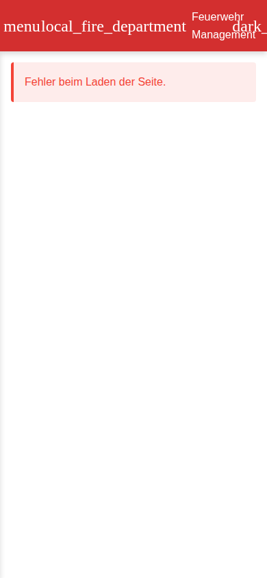

**Funktionen**:
- 📍 Aktuelle Position ermitteln
- 🛣️ Routenberechnung zwischen zwei Adressen (OSRM)
- 📏 Entfernungs- und Zeitanzeige
- 📱 Touch-optimierte Bedienung
- 🗺️ Hardware-beschleunigte Kartendarstellung
- 🎯 Interaktive Marker für Start- und Zielpunkte

#### ⚠️ Gefahrenmatrix

Interaktive AAAA-CCCC-EEEE Einsatzstellengefahren-Matrix zur systematischen Gefahrenerkennung.

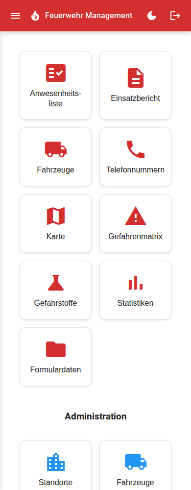

**Gefahrenkategorien**:
- **A** - Atemgifte, Angstreaktionen, Ausbreitung, Atomare Gefahren
- **C** - Chemische Stoffe, Container, Strahlende Stoffe, Elektrizität
- **E** - Erkrankung/Verletzung, Explosion, Einsturz
- Weitere: Tiere, Gewalt, Wasser, Hitze, Verkehr, Umwelt, Radioaktiv

**Funktionen**:
- ✓ Antippen zum Markieren identifizierter Gefahren
- 📋 Echtzeit-Zusammenfassung markierter Gefahren
- 🔄 Reset-Funktion

#### ☣️ Gefahrstoffkennzeichen

Umfassende Gefahrstoff-Datenbank mit GHS-Piktogrammen, ADR-Klassen und UN-Nummern.

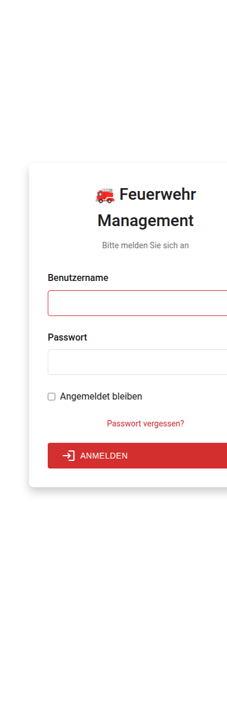

**GHS-Piktogramme** (9 Symbole):
- Explosiv, Entzündbar, Oxidierend, Druckgase, Ätzend
- Giftig, Gesundheitsschädlich, Gesundheitsgefahr, Umweltgefährlich

**ADR-Gefahrgutklassen** (1-9):
- Mit detaillierten Beschreibungen

**UN-Nummern Suche**:
- Datenbank mit 15+ häufigen Gefahrstoffen
- Detailansicht mit:
  - Beschreibung
  - Gefahren
  - Erste-Hilfe-Maßnahmen
  - Brandbekämpfung
  - Freisetzungsmaßnahmen
- Schnellreferenz-Buttons für häufige Stoffe

#### 📞 Wichtige Telefonnummern

Schneller Zugriff auf wichtige Notfallkontakte mit One-Tap-Calling.

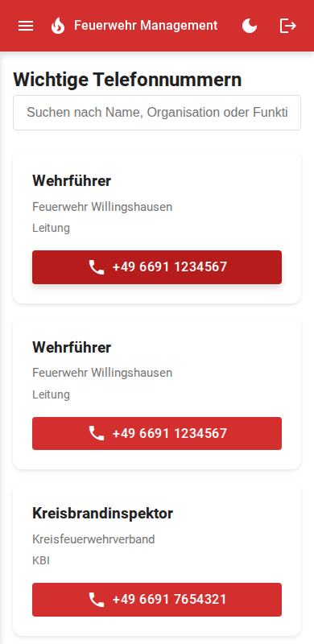

**Funktionen**:
- 📋 Übersichtliche Liste aller Kontakte
- 📱 Direkter Anruf via tel:-Link (One-Tap-Calling)
- 🔍 Anzeige von Name, Firma, Funktion und Telefonnummer

### Statistiken

Umfassende Auswertungen für Übungsdienste und Einsätze auf Abteilungs- und Personenebene.

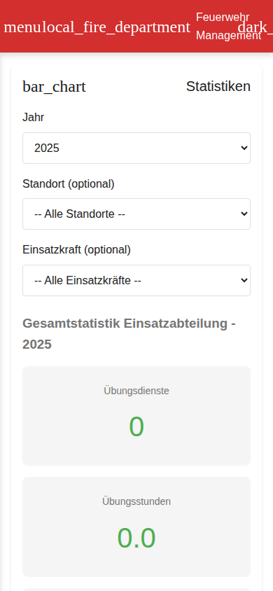

#### Abteilungs-Statistik (Jahresansicht)
- 📊 Anzahl Übungsdienste
- ⏱️ Gesamte Übungsstunden
- 🚒 Anzahl Einsätze
- ⏱️ Gesamte Einsatzstunden
- 📅 Jahres-Auswahl per Dropdown

#### Personen-Statistik
- 👤 Auswahl einzelner Einsatzkraft
- 📊 Detaillierte Aufschlüsselung:
  - Teilgenommene Übungen
  - Absolvierte Übungsstunden
  - Teilgenommene Einsätze
  - Absolvierte Einsatzstunden
  - Gesamtstunden

### Formulardaten

Archiv aller eingereichten Formulare mit Übersicht, Detailansicht und Verwaltungsfunktionen.

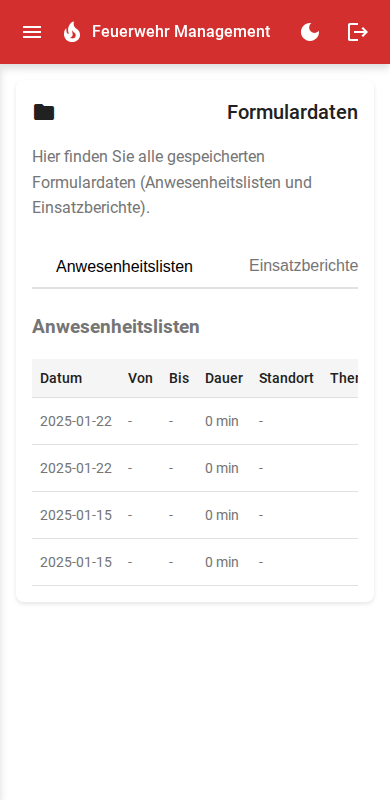

**Verfügbare Daten:**
- **Anwesenheitslisten**: Alle eingereichten Übungsdienste
- **Einsatzberichte**: Alle dokumentierten Einsätze

**Funktionen**:
- 📋 Übersicht aller Formulare nach Datum sortiert
- 🔍 Details einzelner Formulare anzeigen
- 📄 PDF-Dokumente anzeigen/herunterladen
- ✉️ Formulare erneut per E-Mail versenden
- 🗑️ Formulare löschen (nur Admins)
- 🔎 Filterung nach Typ (Anwesenheit/Einsatz)

**Datenschutz:**
- Standort-beschränkte Benutzer sehen nur Formulare ihres Standorts
- Global-Admins haben Zugriff auf alle Formulare
- Alle Daten sind verschlüsselt gespeichert

---

## ⚙️ Konfiguration

### Grundeinstellungen

Alle Einstellungen werden in `config/config.php` vorgenommen:

#### Verschlüsselungsschlüssel
```php
'encryption_key' => 'IHR_32_ZEICHEN_SCHLUESSEL_HIER'
```
Generieren mit:
```bash
php -r "echo bin2hex(random_bytes(16));"
```

#### E-Mail-Einstellungen
```php
'email' => [
    'from_address' => 'noreply@ihre-feuerwehr.de',
    'from_name' => 'Feuerwehr Willingshausen',
    'smtp_host' => 'localhost',
    'smtp_port' => 25,
    'smtp_auth' => false,
    'smtp_username' => '',
    'smtp_password' => '',
    'smtp_secure' => '', // 'tls' oder 'ssl'
]
```

#### App-Einstellungen
```php
'app_name' => 'Feuerwehr Management',
'timezone' => 'Europe/Berlin',
'session_timeout' => 3600, // 1 Stunde
```

#### Datenverzeichnis-Pfade
⚠️ **WICHTIG**: Die Pfade für `data_dir` und `backup_dir` sollten **immer** relative Pfade mit `__DIR__` verwenden:
```php
'data_dir' => __DIR__ . '/../data',
'backup_dir' => __DIR__ . '/../data/backups',
```

**Verwenden Sie KEINE absoluten Pfade** wie `/var/www/html/data`, da diese nicht funktionieren, wenn die Anwendung in einem anderen Verzeichnis installiert wird. Der Installations-Wizard generiert automatisch die korrekten relativen Pfade.

### Logo konfigurieren
Platzieren Sie Ihr Feuerwehr-Logo unter:
```
public/assets/logo.png
```
- Empfohlene Größe: 200x200px oder höher
- Format: PNG mit Transparenz
- Wird verwendet in: E-Mails, PDF-Dokumenten

### Erweiterte Konfiguration

#### Apache .htaccess
Für saubere URLs und erhöhte Sicherheit:
```apache
<IfModule mod_rewrite.c>
    RewriteEngine On
    RewriteBase /
    
    # Schutz für Konfigurationsdateien
    <FilesMatch "config\.php">
        Require all denied
    </FilesMatch>
</IfModule>

# Verzeichnis-Auflistungen deaktivieren
Options -Indexes

# PHP-Einstellungen
php_value upload_max_filesize 10M
php_value post_max_size 10M
```

#### PHP-Einstellungen
Empfohlene `php.ini` Einstellungen:
```ini
upload_max_filesize = 10M
post_max_size = 10M
max_execution_time = 60
memory_limit = 128M
session.gc_maxlifetime = 3600
```

---

## 🔒 Sicherheit

### Implementierte Sicherheitsmaßnahmen

#### Datenverschlüsselung
- **AES-256-CBC**: Alle JSON-Dateien (Einsatzkräfte, Fahrzeuge, Formulare)
- **Unique Initialization Vector (IV)**: Für jede Verschlüsselung
- **OpenSSL**: Moderne Kryptographie-Bibliothek

#### Passwort-Sicherheit
- **bcrypt-Hashing**: Mit Kostenfaktor 10
- **Salted Hashes**: Automatisch durch bcrypt
- **Keine Klartextspeicherung**

#### Session-Sicherheit
- **Session-Timeout**: Automatisches Logout nach Inaktivität
- **Secure Cookies**: httponly & secure Flags (bei HTTPS)
- **Session-Regeneration**: Nach Login

#### Input-Validierung
- **XSS-Schutz**: `htmlspecialchars()` für alle Ausgaben
- **Command Injection Prevention**: Whitelisting + `escapeshellarg()`
- **SQL Injection**: Nicht relevant (keine SQL-Datenbank)

#### Dateisystem-Sicherheit
- **Verschlüsselte Speicherung**: Alle sensiblen Daten
- **Beschränkte Berechtigungen**: 
  - `data/` Verzeichnis: 700
  - `config/config.php`: 600

### Best Practices

1. **Ändern Sie Standard-Passwörter sofort**
2. **Verwenden Sie HTTPS** in Produktionsumgebungen
3. **Regelmäßige Backups** der `data/` und `config/` Verzeichnisse
4. **Firewall-Regeln** für Admin-Bereich
5. **Regelmäßige Updates** von PHP und Abhängigkeiten
6. **Monitoring** der Log-Dateien

---

## 🔧 Troubleshooting

### "Headers already sent" Fehler

**Symptom:** Fehlermeldungen wie `Warning: Cannot modify header information - headers already sent by (output started at config/config.php:1)`

**Ursache:** Die `config/config.php` Datei enthält unsichtbare Zeichen (BOM oder Whitespace) vor dem `<?php` Tag, typischerweise nach manueller Bearbeitung mit bestimmten Text-Editoren.

**Lösung:**

**Option 1 - Automatische Bereinigung (empfohlen):**
1. Laden Sie `fix_config_bom.php` auf Ihren Server hoch
2. Rufen Sie die Datei im Browser auf: `https://ihre-domain.de/fix_config_bom.php`
3. Folgen Sie den Anweisungen zur automatischen Bereinigung
4. Löschen Sie `fix_config_bom.php` nach Gebrauch aus Sicherheitsgründen

**Option 2 - Manuelle Bereinigung:**
1. Laden Sie `config/config.php` via FTP herunter
2. Öffnen Sie die Datei mit einem Editor, der UTF-8 ohne BOM unterstützt:
   - **Notepad++**: Format → UTF-8 ohne BOM
   - **VS Code**: Unten rechts auf "UTF-8 with BOM" klicken → "UTF-8" wählen
   - **Sublime Text**: File → Save with Encoding → UTF-8
3. Stellen Sie sicher, dass:
   - Die Datei mit `<?php` beginnt (kein Whitespace davor)
   - Kein `?>` Tag am Ende vorhanden ist
4. Speichern und via FTP hochladen

**Vorbeugung:**
- Verwenden Sie immer einen Editor mit UTF-8 ohne BOM Unterstützung
- Vermeiden Sie das Kopieren/Einfügen von Config-Inhalten aus Word/Email
- Nutzen Sie den Installations-Wizard statt manueller Config-Erstellung

### Login-Probleme nach der Installation?

Wenn Sie nach dem Installations-Wizard die Fehlermeldung **"Ungültiger Benutzername oder Passwort"** erhalten, gibt es verschiedene mögliche Ursachen.

#### Häufigste Ursachen:
- ❌ Session-Verzeichnis nicht beschreibbar (Nginx/PHP-FPM)
- ❌ Falsche Dateiberechtigungen für config/ oder data/
- ❌ Config-Datei wurde nicht erstellt
- ❌ Browser-Cookies blockiert

#### Schnelle Lösung für Nginx + PHP 8.4:
```bash
# Session-Verzeichnis Berechtigungen
sudo chown www-data:www-data /var/lib/php/sessions/
sudo chmod 733 /var/lib/php/sessions/

# App-Verzeichnis Berechtigungen
sudo chown -R www-data:www-data /pfad/zur/app/config /pfad/zur/app/data
sudo chmod 755 /pfad/zur/app/config /pfad/zur/app/data

# PHP-FPM neu starten
sudo systemctl restart php8.4-fpm

# Browser-Cookies löschen und erneut versuchen
```

---

## 🛠️ Technologie-Stack

### Backend
- **PHP 7.4+**: Hauptprogrammiersprache
- **OpenSSL**: Verschlüsselung (AES-256-CBC)
- **JSON**: Datenspeicherung (verschlüsselt)
- **Sessions**: Authentifizierung & Autorisierung

### Frontend
- **HTML5**: Semantisches Markup
- **CSS3**: Responsive Design, Flexbox, Grid
- **JavaScript (Vanilla)**: Keine Frameworks, moderne ES6+ Features
- **Material Design Icons**: Icon-Set

### PWA-Technologien
- **Service Worker**: Offline-Funktionalität & Caching
- **Web App Manifest**: Installierbarkeit
- **Cache API**: Asset-Caching
- **IndexedDB**: Lokaler Speicher (zukünftig)

### Externe Bibliotheken
- **MapLibre GL JS**: Hardware-beschleunigte Karten-Darstellung
- **OpenStreetMap**: Kartenmaterial (Raster-Tiles)
- **OSRM**: Routing-API (Open Source Routing Machine)

### Architektur
```
feuerwehr-app/
├── config/             # Konfigurationsdateien
│   ├── config.php      # Hauptkonfiguration
│   └── config.example.php
├── data/               # Verschlüsselte JSON-Dateien
│   ├── users.json
│   ├── personnel.json
│   ├── vehicles.json
│   ├── attendance.json
│   ├── missions.json
│   └── phone_numbers.json
├── public/             # Öffentliche Assets
│   ├── css/
│   ├── js/
│   ├── icons/          # PWA Icons
│   └── assets/         # Logo, Bilder
├── src/php/            # PHP Backend
│   ├── api/            # REST API Endpoints
│   ├── forms/          # Formular-Handler
│   ├── pages/          # Seiten-Templates
│   ├── auth.php        # Authentifizierung
│   ├── datastore.php   # Datenverwaltung
│   ├── email_pdf.php   # E-Mail & PDF
│   └── encryption.php  # AES-Verschlüsselung
├── index.php           # Haupteinstiegspunkt
├── manifest.json       # PWA Manifest
└── sw.js               # Service Worker
```

---

## 🎨 Design-Philosophie

Das Design orientiert sich an der [alarm-messenger](https://github.com/TimUx/alarm-messenger) App:

- **Farbschema**: Rot (Feuerwehr-Thema) mit Akzenten
- **Light/Dark Mode**: Automatische Anpassung an Systemeinstellungen
- **Mobile First**: Primär für Smartphone-Nutzung optimiert
- **Touch-freundlich**: Große Buttons, ausreichend Abstand
- **Material Design**: Moderne, intuitive UI-Komponenten
- **Konsistenz**: Einheitliche Bedienung über alle Bereiche

---

## 📄 Lizenz

MIT License

Copyright (c) 2025 Freiwillige Feuerwehr Willingshausen

Permission is hereby granted, free of charge, to any person obtaining a copy
of this software and associated documentation files (the "Software"), to deal
in the Software without restriction, including without limitation the rights
to use, copy, modify, merge, publish, distribute, sublicense, and/or sell
copies of the Software, and to permit persons to whom the Software is
furnished to do so, subject to the following conditions:

The above copyright notice and this permission notice shall be included in all
copies or substantial portions of the Software.

THE SOFTWARE IS PROVIDED "AS IS", WITHOUT WARRANTY OF ANY KIND, EXPRESS OR
IMPLIED, INCLUDING BUT NOT LIMITED TO THE WARRANTIES OF MERCHANTABILITY,
FITNESS FOR A PARTICULAR PURPOSE AND NONINFRINGEMENT. IN NO EVENT SHALL THE
AUTHORS OR COPYRIGHT HOLDERS BE LIABLE FOR ANY CLAIM, DAMAGES OR OTHER
LIABILITY, WHETHER IN AN ACTION OF CONTRACT, TORT OR OTHERWISE, ARISING FROM,
OUT OF OR IN CONNECTION WITH THE SOFTWARE OR THE USE OR OTHER DEALINGS IN THE
SOFTWARE.

---

## 💬 Support

### Bei Fragen oder Problemen

1. **Issues erstellen**: [GitHub Issues](https://github.com/TimUx/feuerwehr-app/issues)
2. **Dokumentation lesen**: Diese README-Datei
3. **Code-Beispiele**: Siehe `config/config.example.php`

### Weiterentwicklung

Geplante Features:
- [ ] Formular-Verwaltung (Archiv mit Bearbeiten/Löschen/Erneut senden)
- [ ] Export-Funktionen (CSV, Excel)
- [ ] Kalender-Integration
- [ ] Push-Benachrichtigungen
- [ ] Multi-Mandanten-Fähigkeit

### Beitragen

Pull Requests sind willkommen! Bitte erstellen Sie zunächst ein Issue für größere Änderungen.

---

**Entwickelt für die Freiwillige Feuerwehr Willingshausen** 🚒

Made with ❤️ in Germany
